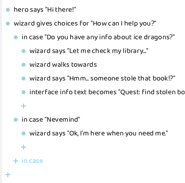

# Introduction

## Overview

This is the **complete documentation** on how to make your own Role Playing Games using [**RPG Playground**](https://rpgplayground.com).

If you just want a quick introduction, take a look at the following [tutorial YouTube video](https://www.youtube.com/watch?v=D54SjyJAxjs):

<iframe width="100%" height="315" src="https://www.youtube.com/embed/D54SjyJAxjs?si=4jm1QdjVRMaZF14T" title="YouTube video player" frameborder="0" allow="accelerometer; autoplay; clipboard-write; encrypted-media; gyroscope; picture-in-picture; web-share" referrerpolicy="strict-origin-when-cross-origin" allowfullscreen></iframe>

## What is RPG Playground?

RPG Playground is the *easiest* tool to make your own games. **No coding** and **no download** required. It runs in your web browser and you can **register for free** at [rpgplayground.com](https://rpgplayground.com).

Imagination is all you need! Programming, graphics and music are provided by us.

Next to making your own games, you can also **share** them, and [**play games** made by others](https://rpgplayground.com/play/).

RPG Playground is constantly under development, so new features are added all the time. Take a look at [our roadmap](https://trello.com/c/OqfFeR7L) to see what is being worked on. You can [vote on your favorite features](https://trello.com/c/OqfFeR7L) to move them up in priority.

RPG Playground is created by me, Koen Witters. You can find me in all the RPG Playground communities listed below. 

## Questions and answers

If you can't find what you are looking for, you can **search**:

- ❓ [Frequenty Asked Questions](https://rpgplayground.com/faqs/).

If you have other **questions**, want to propose **new features**, or just want to **hang out** in our community, reach out at:

- 📰 [RPG Playground community](https://rpgplayground.com/activity/)
- 💬 [Discord chat](https://discord.gg/tyHjdt3)
- 📘 [Facebook group](https://www.facebook.com/groups/rpgplayground)
- 📣 [Reddit forum](https://www.reddit.com/r/rpgplayground/)
- ✉️ Email me at [info@rpgplayground.com](mailto:info@rpgplayground.com)

## Features

### Build your game while playing it

In RPG Playground, you make your game while you play it. There is **no separation between editor and game**.

1. Play your game
2. Open the project panel
3. Make changes
4. Continue playing

:::danger[Most other game maker tools]

Other game maker tools require you to:

1. Edit your game in a separate editor
2. Generate the game (can take some time)
3. Restart your game for playtesting

This kind of workflow is **cumbersome** and **time consuming**.

:::

:::note

I was inspired by [Minecraft](https://www.minecraft.net/) when I created the **build while playing** feature. In Minecraft, you can build your world while you are playing it. This is a very intuitive way of creating content, and I wanted to bring this to RPG Playground.

:::

### No coding required

Our super simple action system allows anyone to add conversations, cut-scenes, and game logic without writing a single line of code.

The action wizard will ask you to select:

1. **Who** needs to do something (the subject)
2. **What** needs to be done (the action)
3. **Details** of the action (such as what to say or where to go)

A new action is then added to a list of actions, which reads like a book or a movie screenplay.

### No download or installation needed

Play straight in your web browser, both on desktop or mobile.

That means Chromebooks, iPads, and even your phone can be used to create games.

### Game & editor features

#### Editor

- Build your world and indoor scenes
- Add interactive NPC’s, monsters and objects to your world
- Create complex conversations and cut-scenes without coding

#### Game

- Control the main hero
- Outdoor and indoor levels
- Talk to NPC’s
- Action RPG combat system
- Inventory items & pickups [⭐](premium)
- Equipment [⭐](premium)

