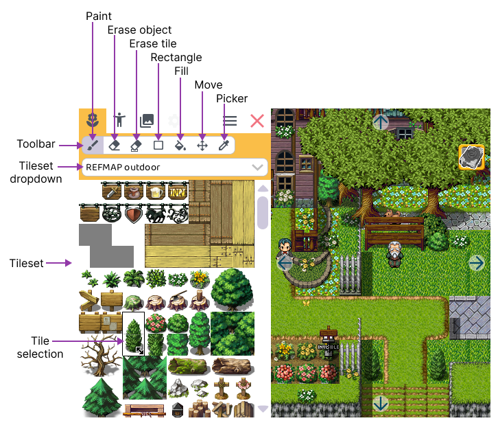
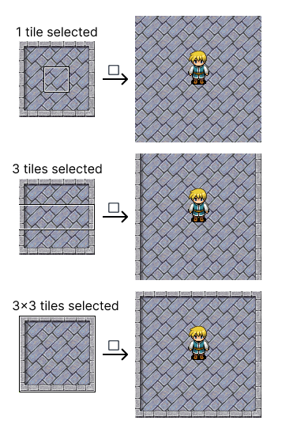

# Scenery

What is a game without a beautiful world to explore?

In the *scenery tab* you can add and remove scenery such as trees, buildings, tables, etc. to your level. This is the first step in creating a beautiful world for your game.

Remark that scenery is not intended to be interacted with.

:::info

Scenery is not only visual, but can include other functionalities:

- Block the movement of actors, which is called *collisions*.
- The height of the tile: to see which tiles need to be placed on top of each other.

:::

:::tip[under development]

In the future, we might support tagging tiles with specific functionalities:

- Ambient sounds: for example water tiles could make a sound.
- Ground tags: for example to indicate which footstep sounds need to be played (walk on wood, grass, ...)
- ...

:::

## Select tiles

Before adding scenery, select the tiles that you want to place on your level. Either select a single tile, or **drag a rectangle to select multiple tiles**.

## Toolbar

The toolbar offers specific tools to modify the scenery in your level. Let's take a look at all of them.

###  Paint object

Place a single object onto the level.

:::info Auto layering

When you place objects, they will automatically be placed in front or behind each other. This seems logical, but in most game development tools this is not the case! 

> Another feature RPG Playground has that others don't 😎.

:::

###  Erase object

Remove a single object from the level. When hovering your mouse over objects, you will get an indication what will be removed.

###  Erase tile

Remove a single tile from the level. Use this when removing an entire object is too much.

###  Fill rectangle

Drag a rectangle on the level to fill it with the selected tile(s). When you select more than 3 tiles of the tileset, auto-tiling will be applied. This means only the inner tile(s) are repeated, and the border tiles are placed at edges.

###  Fill area

Fill an entire area with the selected tile(s). This is useful to quickly fill a large area with the same tile.

###  Move object

Objects can be moved around by selecting the move tool, and clicking on the object you want to move. The object will be selected, and you can drag it around. When you are happy with the new position, release to place it.

###  Tile picker

Don't know in which tileset a certain tile is? Select the tile picker tool, and click on the tile you want to know more about. The tileset dropdown will automatically select the correct tileset, and the tile or object will be selected. This tool will save you a lot of searching time!

## Tileset dropdown

RPG Playground includes multiple tilesets. The tileset dropdown allows you to select the tileset you want to use.

:::tip

Decorate your levels so they feel lively, even when you didn't add all the actors yet.

Think about what the people and creatures would need. A smithy probably needs some wood to burn. A farm needs hay for the animals. A wizard's tower needs a lot of books, and a lot of magical ingredients. Maybe the wizard is very messy and leaves things everywhere. The farmer might have a chair outside, to sit and watch the sunset.

:::

