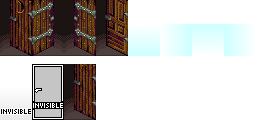
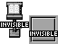
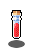

# Actors

Working with the *actors tab* is pretty straight forward. 

1. Click on an actor to **select it**.
2. Click on your level to **place it**. 

You can drag actors around to place them at the desired location.

The `actor dropdown` contains multiple sets of actors, which include:

- **Human-like** that can talk, walk and fight
- **Animals** that more around
- **Monsters** that attack
- **Interactive objects** such as doors, pickups, invisible actors, ...
    

## Doors

Doors can be used going from one place or level to another. There are 2 kinds of doors: one where you enter below the door (the door images you see). The other is where you need to walk on top of it.

Both types also have an invisible variant, that will function but cannot be seen by the player.

## Invisible actors

2 invisible actors are available to use in your game. One you need to bump into, and another you need to walk onto. This can be used to add interaction to static scenery, such as a note on a wall, a sign, a chest, ... .

## Pickups

Pickups can be configured to contain certain items. They either have immediate effect, or are added to the [⭐](/65-premium.md) inventory if enabled.
