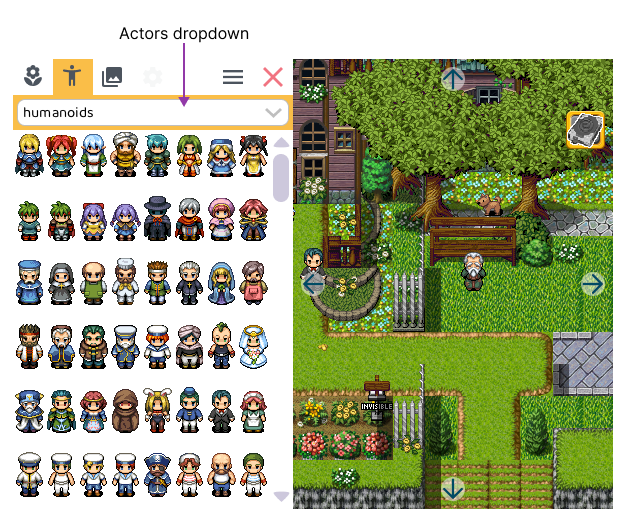

# Actors

Working with the *actors tab* is pretty straight forward. 

1. Click on an actor to **select it**.
2. Click on your level to **place it**. 

You can drag actors around to place them at the desired location.

The `actor dropdown` contains multiple sets of actors, which include:

- **Human-like** that can talk, walk and fight
- **Animals** that more around
- **Monsters** that attack
- **Interactive objects** such as doors, pickups, invisible actors, ...
    

## Doors

## Invisible actors

## Pickups
