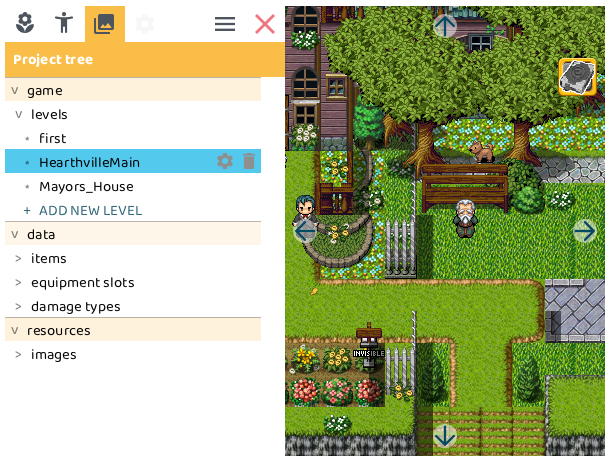

# Project tree

The *project tree* contains all kinds of structural elements of your game. We will explore all of them below

## game

Your game data. Currently only lists the levels.

### levels

All the levels of your game. 

Click on a level to jump to that level.

-  **Properties**: Click to see the properties of the level.
-  **Delete**: Click to delete the level.

Click `+ ADD NEW LEVEL` to add an extra level. There is no limit on the number of levels you can add.

:::tip[under development]

Levels cannot be renamed. We hope to implement this soon, and that feature is on the [roadmap](https://trello.com/c/2dPV7Ojf).

:::

## data [⭐](../premium)

Only available when you purchased the [premium version of RPG Playground](../premium).

The database of your game. This is where you can add and remove all kinds of data that is used in your game.

### items

When you have inventory enabled, your game features items that you can collect. This is where you can add, remove and change properties of items.

> TODO: list properties and their effects

### equipment slots

When you have inventory enabled, the hero can equip certain items. This changes the stats to make the hero stronger.

> TODO: list properties and their effects

### damage types

Monsters and heroes can inflict different types of damage. This is where you can add, remove and change properties of damage types.

> TODO: list properties and their effects

## resources [⭐](../premium)

Only available when you purchased the [premium version of RPG Playground](../premium).

All the file resources of your game. This includes images, and in the future also music and sounds.

### images

All the images that are used in your game. You can replace the graphics of existing images right now. In the future you will be able to add and delete images.

> TODO: more info on replacing graphics
