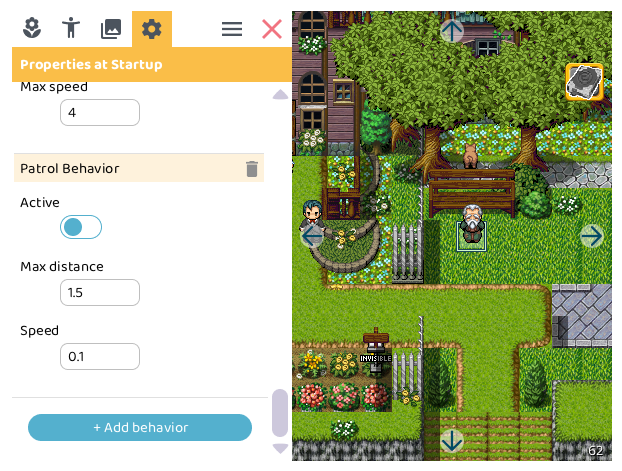
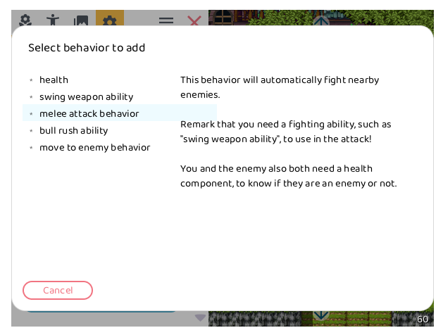

# Behaviors

Actors can have various behaviors.

## Add behavior

You can add a new behavior to an actor by clicking on the `+ Add behavior` button in the properties panel.

This will open a dialog where you can select the behavior you want to add.

## Remove behavior

Each behavior in the properties panel has a  remove button. Clicking this button will remove the behavior from the actor.