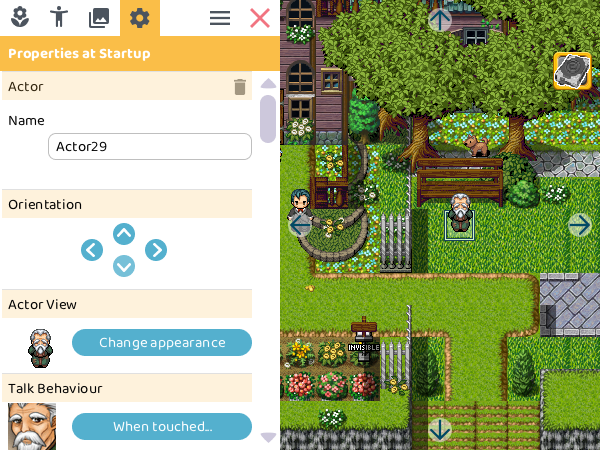
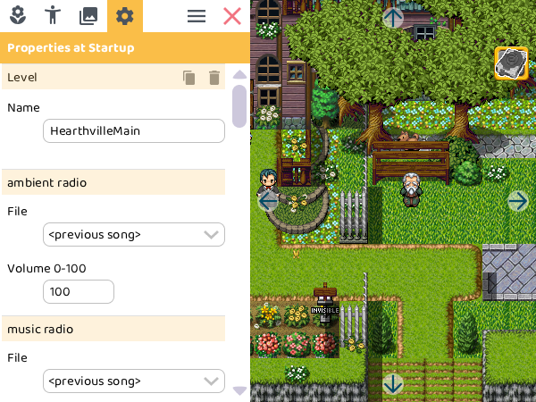
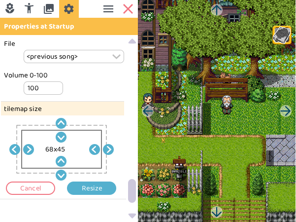

# Properties

## Actor properties

When you click on an actor, its properties will show.

- **Delete** the actor by clicking on the  waste-bin on the top.
- **Change the name** by editing the text field.
- **Other properties** depend on which behaviors the actor has.

:::tip[Under development]

The `hero` cannot be renamed yet, which is something we're still [working on](https://trello.com/c/2dPV7Ojf). It also can't be deleted.

:::

## Level properties

When you click on [level properties](../project-tree), the properties of that level will show.

-  **Copy**: Make a copy of this level. This only copies the scenery and *not* the actors.
-  **Delete**: Click to delete the level.

:::tip[Under development]

Levels cannot be renamed yet, which is something we're still [working on](https://trello.com/c/2dPV7Ojf).

:::

### Ambient/music radio

Levels can play both music and ambient sounds in the background. This will start playing once you enter this level. Afterwards you can still change what is playing with actions.

- **File**: select what to play in the background of the level:
    - **\<previous song\>**: Keep playing the song that's already playing from a previous level.
    - **\<silence\>**: Don't play anything.
    - **...**: Various songs to select.
- Play **volume** can be set from **0** (mute) to **100** (loudest).

### Tilemap size

Change the size of the tilemap and level:

1. Click on the arrows to increase or decrease the level.
2. Click `Resize` to apply the changes.
3. Click `Cancel` to discard the changes.

