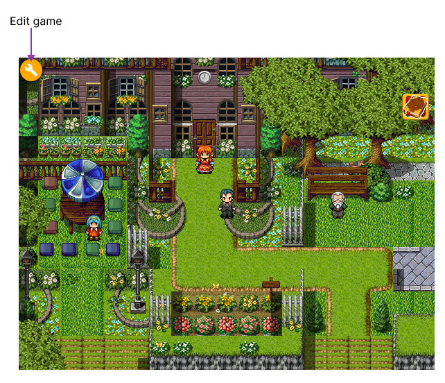
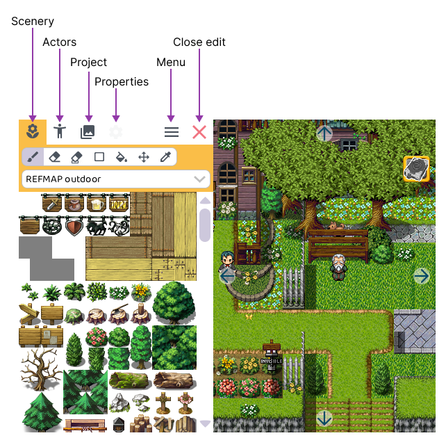

# Making games

## Your first game

RPG Playground is ideal for making your first game. It's **simple,** **intuitive** and **easy**. And most of all, it makes game development **fun**!

## The edit panel

When your game is running, on the top-left there is an `Edit game` button. 

When clicking it, the *edit panel* will open on the left side of the screen. The game will be paused at that point

:::tip[Fun fact]

When I was first developing RPG Playground, the editor would keep the game running. This resembles how Minecraft works. But it was too cumbersome to click on moving monsters etc., so I implemented a pause, which works much better.

:::

### Tabs

The *edit panel* contains the following tabs:

-   [ **Scenery**](scenery): add and remove scenery such as trees, buildings, tables, etc. to your level
-   [ **Actors**](actors): add and remove game characters, monsters and interactive objects
-   [ **Project tree**](project-tree): overview of your complete game, data and resources
-   [ **Properties**](properties): properties of the currently selected actor, level, ...

###  Menu button

Press the `Menu` button to open a popup with:

- `Restart game`: Restarts your game from the beginning
- `Fullscreen`: Maximize RPG Playground over your entire screen.

###  Close button

Press the `Close edit` button on the top-right to close this dialog and resume playing your game.