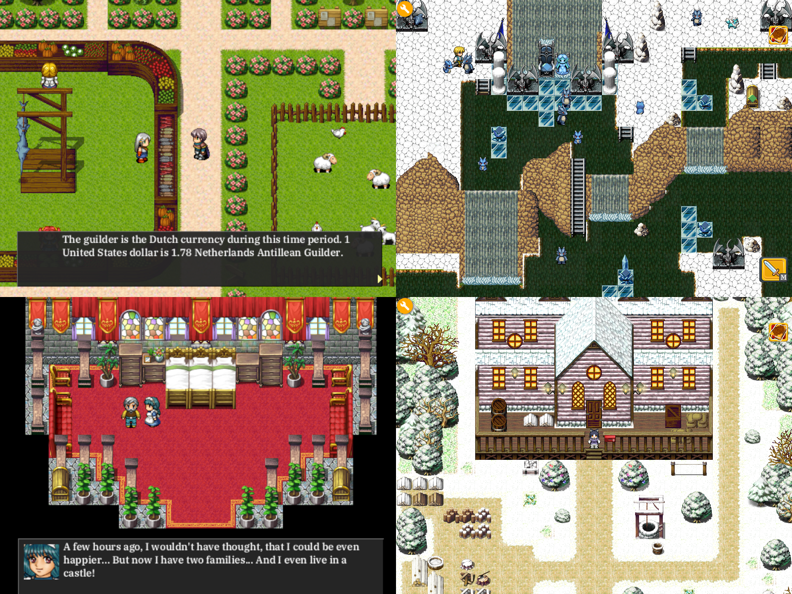

# STEM diversity & inclusion

Statistics show that [women are under-represented in STEM fields](https://en.wikipedia.org/wiki/Women_in_STEM_fields).

I am the father of 3 daughters and a son. My personal opinion is that most coding platforms don't do a good job at balancing the preferences of both girls and boys. I will show you how RPG Playground does this better.

Most STEM curriculums use game development to introduce students to programming. This keeps students engaged and motivated. This is great, because in recent years, the ratio of female to male gamers [balanced out](https://en.wikipedia.org/wiki/Women_and_video_games). 

However, when you look at their preferences, they [greatly differ](https://en.wikipedia.org/wiki/Women_and_video_games#Genre_preferences):

In gaming, men prefer *sports*, *action shooters* and *strategy games*. Women prefer *puzzle games*, *exploration*, and *story-driven games*. Their primary motivations of why they play games are very different:

### Girls enjoy:

- **Fantasy**: Immersion and exploring other worlds
- **Design**: Expressing themselves, building or customizing things
- **Community**: Socializing and collaborating with others
- **Story**: Elaborate narrative and well-developed characters

### Boys enjoy:

- **Competition**: Competing with other players
- **Destruction**: Blowing things up, creating chaos
- **Fantasy**: Immersion in and exploring other worlds (same as girls!)
- **Strategy**:	Decision-making and planning, balancing resources and goals

### Other coding platforms

When you look at most game coding platforms, they heavily focus on *action*. Fantasy ❌, design ❌ or story elements ❌ are unfortunately non-existent. 

### RPG Playground

RPG Playground features **fantasy worlds** ✅, **character design** ✅ and **story elements** ✅ out of the box. While also supporting **action** ✅ elements. 

This makes RPG Playground a more inclusive platform, and balances out different preferences in both boys and girls:

