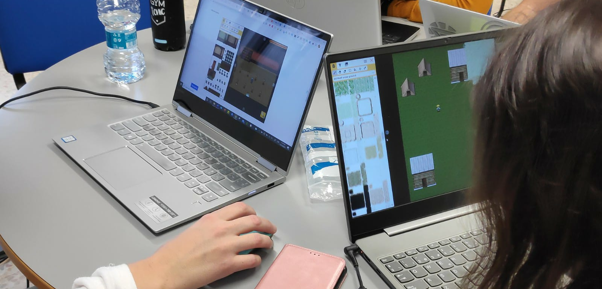
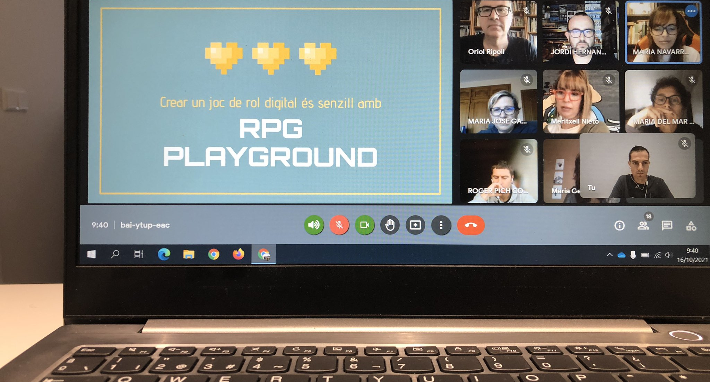

# For Educators

Using RPG Playground in the classroom is a fantastic choice for engaging students in a unique and interactive way. Here’s why it’s perfect for educational settings:

### Why RPG Playground?

- 🎓 **Beginner-friendly**: Intuitive and easy to use, allowing students to jump right in.
- 💾 **No download or installation needed**: Runs in the browser on any internet-connected device, including Chromebooks.
- 🎮 **No coding required**: *Action Wizard* enables students to create games without writing any code.
- 🔒 **Privacy first**: We don’t collect personal information and comply with privacy regulations.
- 🎉 **Student enthusiasm**: Students enjoy RPG Playground so much that they often introduce it to their teachers, making it a popular choice for group projects.
- Continue on any device

RPG Playground is used in classrooms around the world, from elementary, middle and high schools, all the way up to colleges and universities.

### Learning Opportunities

RPG Playground offers a diverse range of applications that are perfect for STEM subjects and extend far beyond:

- 🏰 **History**: Create games set in historical periods for immersive learning.
- 📖 **Literature & storytelling**: Recreate scenes from books or craft original stories.
- 🧠 **Logical thinking & problem solving**: Enhance cognitive skills through game creation.
- 🎨 **Game design**: Focus on game mechanics without the complexity of programming.
- 💻 **Intro to coding**: Teach Object-Oriented Programming (OOP) concepts through our actions system.
- 💵 **Financial literacy**: Create games that simulate real-world financial scenarios.

### Classroom Integration

Explore the different ways RPG Playground can be utilized in the classroom:

1. **Student-created games**: Individually, in pairs, or groups, students can design their own games.
2. **Teacher-created games**: Educators can develop educational games for students to play.
3. **Group projects**: Students can collaboratively create educational games on various topics, sharing and learning from each other’s creations.

### Getting Started

Using RPG Playground in the classroom can be engaging and exciting for students. Here’s how you can begin:

1. [**Sign Up for Free**](https://rpgplayground.com/register/): Access our free version and start exploring.
2. [**Upgrade to Teacher Dashboard**](https://rpgplayground.com/teacher/): Unlock advanced features and management tools for an enhanced experience.

---

### Join Our Community

Connect with other educators and share your experiences on our [Game Technology for Teachers Facebook Group](https://www.facebook.com/groups/gamesforteachers).

